### ATTENTION

This page is under construction.

### Author
[Afzal Hussain](https://illusorytime.github.io/)

### Why This Blog
This January, during the starting of 7th semester I completed Andrew Ng’s Deep Learning Specialization from Coursera. I was really fascinated how I can use different deep learning algorithms so that it can be useful in mechanical engineering. Than suddenly an idea came to my mind, deep learning models can be used to predict fluid simulation and after that I started doing research on this.

This blog is about the whole procedure that I have gone through, from generating fluid simulation to deep learning model everything is explained here.

### Problem Specification

### Case Setup
For this research, I have used OpenFOAM, an C++ open source implementation for per-processing, solving and post-processing CFD simulation. The reason behind choosing OpenFOAM because its flexibility and automatization. Here supersonic flow over a forward-facing step is investigated. The problem description involves a flow of Mach 3 at an inlet to a rectangular geometry with a step near the inlet region that generates shock waves. The geometry is shown below:

  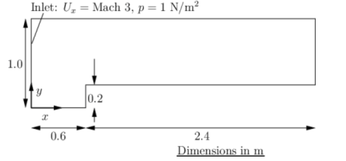

### Generating simulation 
This is the most laborious task. As deep learning requires plenty of data, I needed about thousands of simulations of varying geometries so that it can predict simulation of unknown geometry. For this purpose, I changed the position of step from near the inlet region to the outlet i.e.  0.1 < x < 2.9, changing it height from 0.1 to 0.4 m. This is done by a python script where each steps are described with comments. Making the dataset contains following steps:
  1. Make 1500 random coordinates within some constraints.
  2. Remove previous simulation file (if it exists).
  3. Copy the OpenFOAM _forwardStep_ directory.
  4. Remove _blockMeshDict_ file from system directory.
  5. Execute `gen_blockMeshDict.py` to write _blockMeshDict_ and _cellInformation_ file.
     _cellInformation_ consists cell number of three rectangle (x_cell * y_cell) (2D simulation). 
  6. Move _blockMeshDict_ file to system directory
  7. Move _cellInformation_ file to home directory
  8. Now execute `sim_cmd` from terminal. 
  9. It uses _sonicFoam_ to run simulation.
10. And _foamToVTK_ to convert the simulation result into .vtk file.

After this almost 168GB simulation data has been generated. But all this data is not necessary training, we extract only velocity at x & y direction, pressure and temperature of each cell. dl_data_generation is used to do this tasks.

### Convolutional LSTM
For long-range dependencies in time-series data, LSTM has been using for a longer period of time, that has proven stable and powerful. But typical LSTM implementation deals with 1-D series data only, as fluid simulation involves with spatial data, we need to use a variant of LSTM, proposed by X Shi et al, where state-to-state and input-to-state transitions are replaced by convolution operation. The key equations are shown below, where ‘∗’ denotes the convolution operator and ‘◦’ denotes the Hadamard product:

  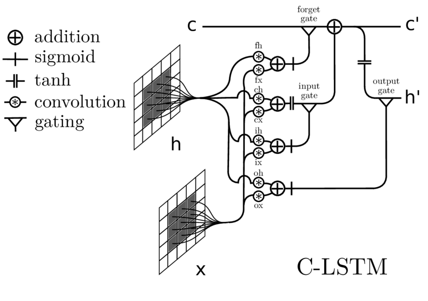

### Deep Learning Model 

  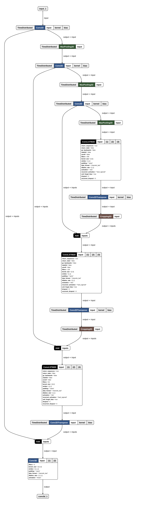

### Results so far
#### Velocity

  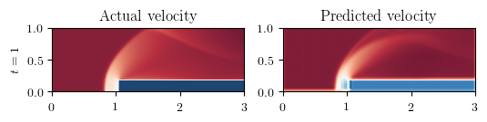
  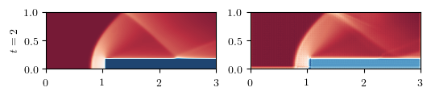
  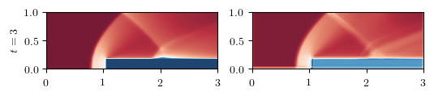
  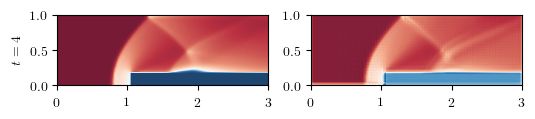
  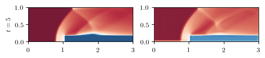

  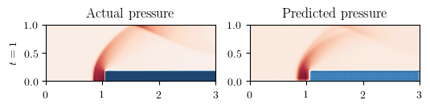
  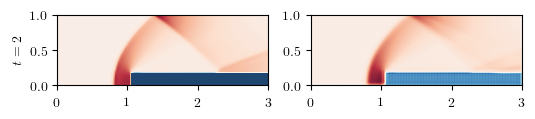
  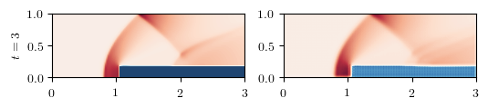
  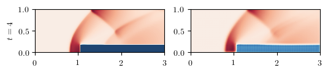
  

  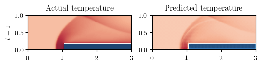
  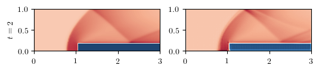
  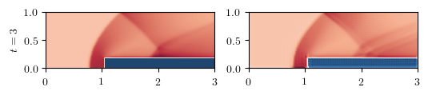
  
  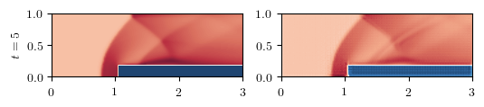

### What to-do next

### Conclusion

### Related Research